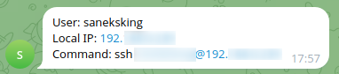

# Get SSH IP <sup>v0.1.0</sup>

---
[](https://github.com/saneksking/get_ssh_ip/)

[](https://github.com/saneksking/get_ssh_ip/blob/master/LICENSE)
---
**Get SSH IP** - Telegram Bot for get a command for connect to your SSH server
---

## Help:

- Clone project
- Create file `config.json` in your project and enter:
```json
{
    "token": "your telegram token",
    "admins": [
        "chat_id1",
        "chat_id1"
    ]
}
```

---

## Run:

`python app.py`

---



---

## Disclaimer of liability:

    THIS SOFTWARE IS PROVIDED BY THE COPYRIGHT HOLDERS AND CONTRIBUTORS "AS IS"
    AND ANY EXPRESS OR IMPLIED WARRANTIES, INCLUDING, BUT NOT LIMITED TO, THE
    IMPLIED WARRANTIES OF MERCHANTABILITY AND FITNESS FOR A PARTICULAR PURPOSE ARE
    DISCLAIMED. IN NO EVENT SHALL THE COPYRIGHT HOLDER OR CONTRIBUTORS BE LIABLE
    FOR ANY DIRECT, INDIRECT, INCIDENTAL, SPECIAL, EXEMPLARY, OR CONSEQUENTIAL
    DAMAGES (INCLUDING, BUT NOT LIMITED TO, PROCUREMENT OF SUBSTITUTE GOODS OR
    SERVICES; LOSS OF USE, DATA, OR PROFITS; OR BUSINESS INTERRUPTION) HOWEVER
    CAUSED AND ON ANY THEORY OF LIABILITY, WHETHER IN CONTRACT, STRICT LIABILITY,
    OR TORT (INCLUDING NEGLIGENCE OR OTHERWISE) ARISING IN ANY WAY OUT OF THE USE
    OF THIS SOFTWARE, EVEN IF ADVISED OF THE POSSIBILITY OF SUCH DAMAGE.

***

## Copyright:
    --------------------------------------------------------
    Licensed under the terms of the BSD 3-Clause License
    (see LICENSE for details).
    Copyright © 2024, A.A. Suvorov
    All rights reserved.
    --------------------------------------------------------
